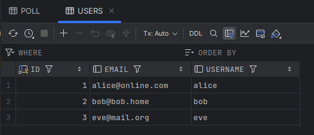
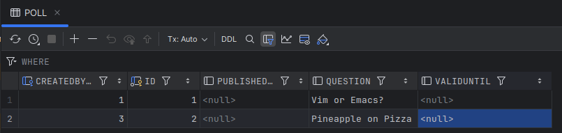
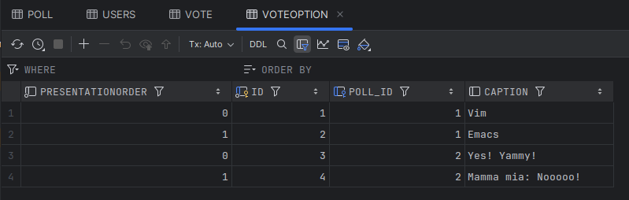
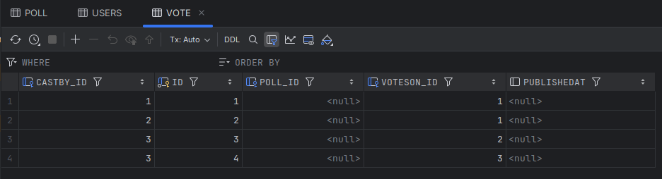

# DAT250: Software Technology Experiment Assignment 4 - Hand-in Report

## Project Overview

Successfully implemented persistence for the poll application using Java Persistence API (JPA) with Hibernate ORM and an H2 in-memory database. The application models polls, users, vote options, and votes with proper entity relationships. The implementation ensures data integrity through bidirectional mappings and cascading operations.

Additionally, adapted frontend and backend integration to fully support `Long`-based IDs and fixed duplication issues with vote options.

---

## Technical Problems Encountered and Solutions

### 1. **Entity ID Type Mismatch**

**Problem**: My project from Assigment 3 used `String` as entity IDs (set via UUIDs in `PollManager`), which conflicted with JPA’s need for numeric auto-generated primary keys.

**Solution**: Changed all entity IDs from `String` to `Long` and annotated them as:

```java
@Id
@GeneratedValue(strategy = GenerationType.IDENTITY)
private Long id;
```

Also updated the frontend so that IDs are treated as numbers (`Number(...)`) instead of `String(...)`, ensuring API requests and responses matched the new backend logic.

---

### 2. **Missing `poll` Field in `Vote`**

**Problem**: Hibernate reported:

```
Collection 'Poll.votes' is 'mappedBy' a property named 'poll' which does not exist
```

because the `Vote` entity lacked a back-reference to `Poll`.

**Solution**: Added the missing relationship:

```java
@ManyToOne
private Poll poll;
```

---

### 3. **Unmapped `VoteOption` ↔ `Vote` Relationship**

**Problem**: Votes were not properly linked to vote options, preventing correct schema generation.

**Solution**: Established a bidirectional mapping:

```java
// In VoteOption.java
@OneToMany(mappedBy = "votesOn", cascade = CascadeType.ALL, orphanRemoval = true)
private Set<Vote> votes = new LinkedHashSet<>();

// In Vote.java
@ManyToOne
private VoteOption votesOn;
```

---

### 4. **Delete Poll Ownership Issue**

**Problem**: When switching between users, deletion of polls was incorrectly tied to the last created user, instead of the currently selected user.

**Solution**: Fixed logic in `PollManager` to correctly check poll ownership against the chosen user rather than always using the last created one.

---

### 5. **Duplicate Vote Options in API Responses**

**Problem**: When fetching polls, each vote option appeared twice: once without an ID/poll reference, and once with the correct values.

**Solution**: Cleaned up the poll–voteOption relationship management so that vote options are only persisted through the `Poll` entity. This ensured that only the managed, persisted instances appear in responses.

---

## Changes made to the base project

We started from a base project without persistence annotations and IDs defined as `String`.
To adapt the project to JPA, the following changes were applied:

### General

* Added **JPA annotations** (`@Entity`, `@Id`, `@GeneratedValue`, `@OneToMany`, `@ManyToOne`, `@JoinColumn`) across the entity classes.
* Changed entity IDs from `String` to `Long` with **auto-generated values** using:

  ```java
  @Id
  @GeneratedValue(strategy = GenerationType.IDENTITY)
  private Long id;
  ```
* Imported the necessary JPA classes from `jakarta.persistence.*`.
* Updated the **frontend code** to use numeric IDs instead of strings when sending/receiving data.

---

### Poll.java

* Added `@Entity` to mark the class as a JPA entity.
* Changed `id` field from `String` to `Long` with `@Id` and `@GeneratedValue`.
* Added two bidirectional relationships:

  ```java
  @OneToMany(mappedBy = "poll", cascade = CascadeType.ALL, orphanRemoval = true)
  private Set<VoteOption> options = new HashSet<>();

  @OneToMany(mappedBy = "poll", cascade = CascadeType.ALL, orphanRemoval = true)
  private Set<Vote> votes = new HashSet<>();
  ```

---

### VoteOption.java

* Added `@Entity`.
* Added `id` field with `@Id` and `@GeneratedValue`.
* Added relationship to `Poll`:

  ```java
  @ManyToOne
  private Poll poll;
  ```
* Added relationship to `Vote`:

  ```java
  @OneToMany(mappedBy = "votesOn", cascade = CascadeType.ALL, orphanRemoval = true)
  private Set<Vote> votes = new LinkedHashSet<>();
  ```

---

### Vote.java

* Added `@Entity`.
* Added `id` field with `@Id` and `@GeneratedValue`.
* Added relationship to `VoteOption`:

  ```java
  @ManyToOne
  private VoteOption votesOn;
  ```
* Added relationship to `Poll`:

  ```java
  @ManyToOne
  private Poll poll;
  ```

---

## Database Configuration and Schema Analysis

### Database Setup for Testing and Inspection

To enable database table inspection during testing, the project was configured to use a file-based H2 database instead of an in-memory database. This allows the database to persist after test execution, making it possible to examine the generated schema and test data.


The key modification made to the `PollsTest.java` file was changing the JDBC URL from in-memory to file-based storage:

**Before:**
```java
.property(PersistenceConfiguration.JDBC_URL, "jdbc:h2:mem:polls")
```

**After:**
```java
.property(PersistenceConfiguration.JDBC_URL, "jdbc:h2:file:./build/polls-db")
```

This change creates a physical database file at `DAT250-Assigment4/build/polls-db.mv.db` that persists after test execution.

### Database Connection in IntelliJ

The H2 database can be accessed through IntelliJ's Database tool window using the following connection parameters:
- **URL**: `jdbc:h2:file:./build/polls-db`
- **User**: `sa`
- **Password**: (empty)

## Database Schema Analysis

Hibernate automatically generated the following tables based on the JPA entity mappings:

### 1. USERS Table
- **Purpose**: Stores user information
- **Columns**:
    - `id` (Primary Key): Auto-generated user identifier
    - `username`: Unique username for each user
    - `email`: User's email address
- **Relationships**: Serves as the owner of polls through the application logic



### 2. POLL Table
- **Purpose**: Stores poll definitions and metadata
- **Columns**:
    - `id` (Primary Key): Auto-generated poll identifier
    - `question`: The poll question text
    - `created_by`: References the user who created the poll (implied by application logic)
    - Additional metadata columns for timestamps and status
- **Relationships**:
    - One-to-Many with `VOTEOPTION` (a poll has multiple voting options)
    - One-to-Many with `VOTE` (a poll collects multiple votes)



### 3. VOTEOPTION Table
- **Purpose**: Stores the available voting options for each poll
- **Columns**:
    - `id` (Primary Key): Auto-generated option identifier
    - `caption`: The text description of the voting option
    - `presentation_order`: Determines the display order of options
    - `poll_id` (Foreign Key): References the parent poll
- **Relationships**:
    - Many-to-One with `POLL` (each option belongs to one poll)
    - One-to-Many with `VOTE` (each option can receive multiple votes)



### 4. VOTE Table
- **Purpose**: Records individual votes cast by users
- **Columns**:
    - `id` (Primary Key): Auto-generated vote identifier
    - `user_id` (Foreign Key): References the user who cast the vote
    - `option_id` (Foreign Key): References the selected voting option
    - `poll_id` (Foreign Key): References the poll being voted on
    - `timestamp`: When the vote was cast
- **Relationships**:
    - Many-to-One with `USERS` (each vote is cast by one user)
    - Many-to-One with `VOTEOPTION` (each vote selects one option)
    - Many-to-One with `POLL` (each vote belongs to one poll)




### Foreign Key Constraints
The database maintains referential integrity through foreign key constraints:
- `VOTE.poll_id → POLL.id`
- `VOTE.option_id → VOTEOPTION.id`
- `VOTEOPTION.poll_id → POLL.id`


## Test Scenario

The application supports the following scenario:

1. **User Creation**: A new user can be created with username and email.
2. **Poll Creation**: A user creates a poll with a question.
3. **Adding Vote Options**: Vote options can be added to the poll with proper `presentationOrder`.
4. **Voting**: A user can vote for one of the available options.
5. **Bidirectional Relationships**: Votes and polls are correctly linked to their users and options.
6. **Persistence Test**: Running `PollsTest` verifies that entities are created, persisted, and queried successfully.
7. **Frontend–Backend Consistency**: Verified that React frontend correctly interacts with numeric IDs when creating, voting, and deleting polls.

👉 In addition, the application also passes all the tests of the previous Assignments.

---

## Link to Code

* Code from Assigment 1: [https://github.com/WonderBattle/DAT250-Assigment1](https://github.com/WonderBattle/DAT250-Assigment1)
* Code from Assigment 2: [https://github.com/WonderBattle/DAT250-Assigment2](https://github.com/WonderBattle/DAT250-Assigment2)
* Code from Assigment 3: [https://github.com/WonderBattle/DAT250-Assigment3](https://github.com/WonderBattle/DAT250-Assigment3)

---

## Key Features Implemented

### ✅ Entity Annotations

* `@Entity` added to `Poll`, `VoteOption`, `Vote`, and `User`.
* `@Id` and `@GeneratedValue` for primary keys.

### ✅ Relationships

* **Poll ↔ Vote**: One-to-many, mapped by `poll`.
* **Poll ↔ VoteOption**: One-to-many, mapped by `poll`.
* **VoteOption ↔ Vote**: One-to-many, mapped by `votesOn`.
* **Vote ↔ VoteOption**: Many-to-one with join column `option_id`.
* **Vote ↔ Poll**: Many-to-one with implicit join column `poll_id`.

### ✅ Database Schema

Hibernate automatically generated the following tables in H2:

* `poll`
* `vote_option`
* `vote`
* `user`

Foreign keys:

* `vote.poll_id → poll.id`
* `vote.option_id → vote_option.id`
* `vote_option.poll_id → poll.id`

### ✅ Frontend Integration

* Adapted React code to properly send and handle numeric (`Long`) IDs.
* Fixed duplicated vote option issue by cleaning up relationship handling in backend.

---

## Pending Issues

### 1. **Column Naming**

Currently relying on Hibernate’s default column names. For production, explicit `@JoinColumn(name = "...")` annotations should be standardized.

### 2. **Validation**

No validation annotations (`@NotNull`, `@Size`) implemented yet for entity fields.

### 3. **Cascade Deletes**

Although cascading works for some relationships, deletion scenarios (e.g., removing a `Poll`) need more thorough testing.

### 4. **PollManager**

Still uses in-memory `HashMap` storage for certain operations. Full migration to JPA repositories would simplify persistence handling.

### 5. **Warnings in Tests**

Some warnings appear when running GitHub Actions tests (mainly from old `requests.http` UUID IDs), but all tests pass correctly. These should be aligned with `Long` IDs for consistency.

---

## Conclusion

The assignment was successfully completed with a fully working persistence layer for polls, vote options, and votes.
The main challenges involved adapting entity IDs from `String` to `Long`, fixing missing relationships, solving poll ownership issues, avoiding duplicate vote options, and ensuring frontend–backend consistency.

By resolving these, Hibernate correctly generated the database schema, and the provided test case passed.
This assignment provided valuable experience with JPA, Hibernate mappings, schema inspection in H2, and debugging real-world integration issues across backend and frontend.

